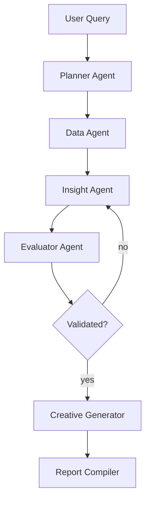

# Agent Graph — Kasparro Agentic Facebook Analyst

### Planner Agent
Breaks user query into subtasks: load data, summarize, identify low-CTR segments, hypothesize, validate, create creatives.

### Data Agent
Loads dataset and produces summaries: ROAS trend, CTR by campaign, creative samples.

### Insight Agent
Generates hypotheses from summaries.

### Evaluator Agent
Quantitatively validates hypotheses using thresholds from config.

### Creative Generator
Produces headline/text/CTA suggestions for low-CTR campaigns based on dataset samples.
